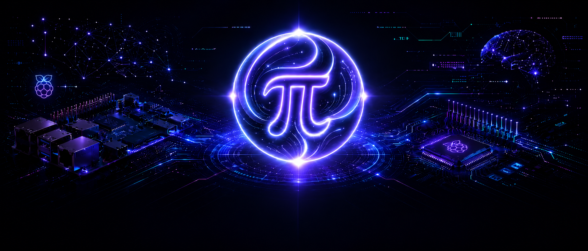
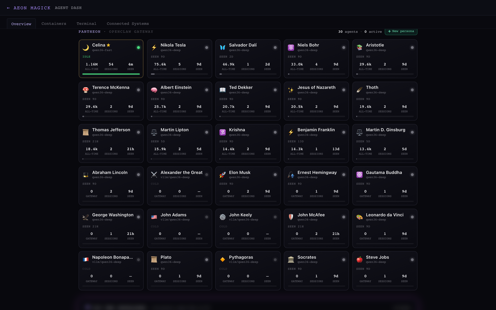
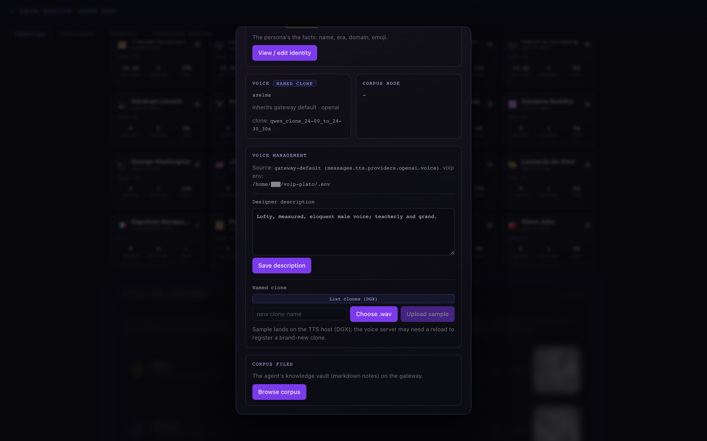
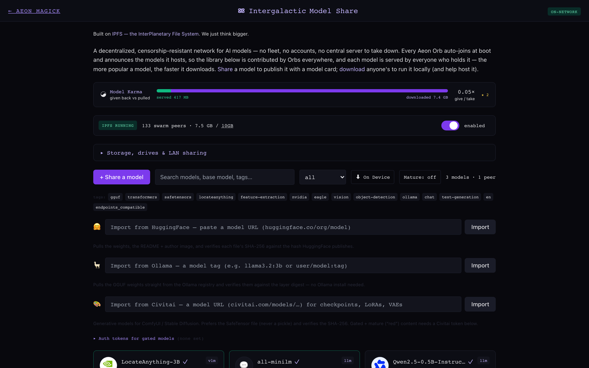
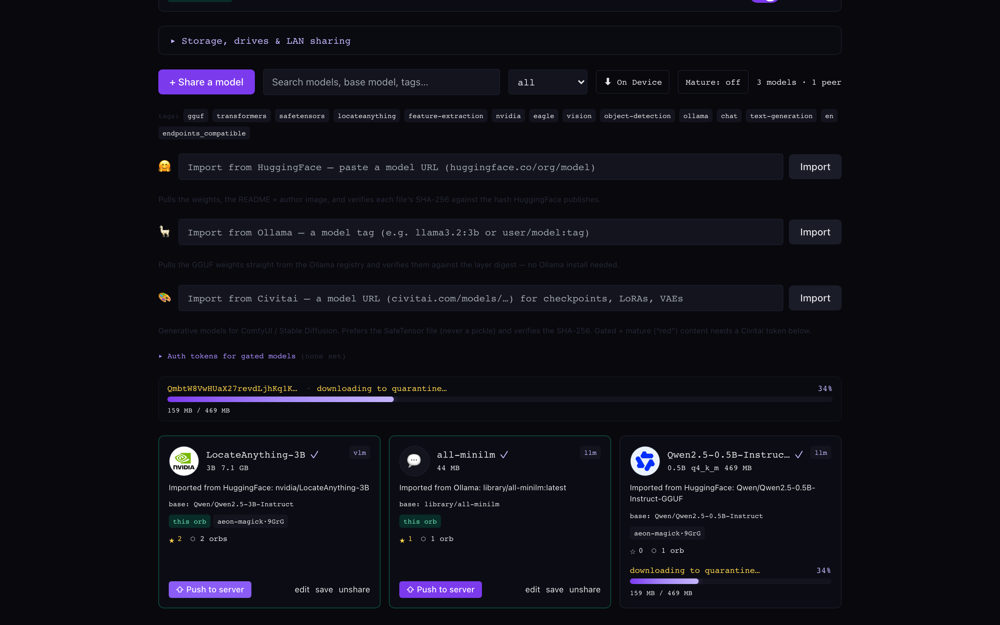

<p align="center">
  
</p>

# 🔮 Aeon Magick Orb

> ## _The Universe's Strangest Peripheral._
> **Every Aeon master has one.** _(we also just call it the **cursed HID**.)_

### Gaze into the Orb and you **see and command any computer — and your entire AI lab.** It hands any AI agent a **physical presence** at any machine: real eyes, real hands, **zero software on the target.** It just looks like a USB keyboard and mouse.

> 🤖 **Every capability is provisioned to your AI agent over a REST API _and_ a first-class MCP endpoint** — drop-in **agentic control** for *any* model and *any* agent. No SDK, no plugin, no permission prompt.

One small box you can hold in a pocket, and you can:

- 🖥️ **View and control your entire AI infrastructure** — every gateway, DGX Spark, and model server, from one console.
- 🤖 **Grant your AI agent a physical presence** at any computer — vision in, keyboard / mouse / gesture out, from the **BIOS** on up.
- 🛡️ **Secure your network traffic** — one-click VPN · Tor · I2P · encrypted **no-log DNS**, filterable by latency *and* jurisdiction.
- 🌍 **Access it all from anywhere** — one-key Tailscale mesh; carry the Orb to any network and your whole lab comes with it.
- 🧠 **Build up your Pantheon** of AI agent personas — each with a soul, a voice, a corpus, and a face — and summon them to act.
- 💾 …**deploy models**, **orchestrate containers**, **install an OS lights-out**, and **back the whole config up, encrypted**. _(keep scrolling 👇)_

> **All it takes:** a **Raspberry Pi 4 or Pi 5**, any HDMI capture device, and a data-capable USB-C cable. Add a Hailo AI HAT+, a UPS, and an NVMe/SSD to unlock on-device vision and a shareable model library. [Full hardware list ↓](#hardware-youll-need)

This isn't just Agentic AI. It's **_Robo_-Agentic AI** — the disembodied, given a body.

```
        ┌──────────────────┐                          ┌──────────────────┐
        │   Target host    │                          │  You / your AI   │
        │  (any OS — Mac,  │   HDMI → Cam Link 4K     │   ┌────────────┐ │
        │   Windows, Linux,│ ───────────────────────► │   │ web UI on  │ │
        │   BIOS, FileVault│                          │   │ laptop or  │ │
        │   prompt, …)     │ ◄─────────────────────── │   │ AI agent   │ │
        └──────────────────┘   USB-C OTG ← Pi gadget  │   │ kbd+mouse+ │ │
                                emulating Logitech /  │   │ trackpad + │ │
                                Apple keyboard+mouse  │   │ gestures   │ │
                                                      │   └────────────┘ │
                                                      └──────────────────┘
```

Nothing to install. Nothing to grant. **Pull the plug and access is instantly,
physically gone.**

---

## Everything the Orb does, at a glance

One box is a computer-control rig, an AI-infrastructure jump box, a persona studio,
a privacy router, and a lights-out KVM. Tap any capability to jump to the deep dive.

| | Superpower | Why it's a superpower |
|---|---|---|
| 🖥️ | **[Zero-software computer control](#zero-software-computer-control-for-any-agent)** | See real pixels, move the mouse, type, click — on **any** machine, **any** OS, even **pre-OS**. Nothing installed on the target, ever. |
| 👁️ | **[On-device vision grounding + VLM](#zero-software-computer-control-for-any-agent)** | The Orb's own **Hailo AI HAT+** reads the screen: `screen_find` returns **click-ready coordinates** for any on-screen label, and `describe_screen` answers *"what is this screen?"* in plain language — no cloud round-trip. |
| 🔌 | **[The cursed HID](#the-cursed-hid--it-just-looks-like-a-keyboard)** | To the target it's a boring USB keyboard + mouse. No SDK, no agent in your files, no permission prompt. Powered over the same cable — no PSU. |
| 🧠 | **[Build a pantheon of AI personas](#build-your-pantheon-of-ai-personas)** | Each agent gets a Soul, Identity, corpus, profile picture, and its **own designed-or-cloned voice**. Summon one specialist, or call several in parallel and let them talk. |
| 🛰️ | **[Centralized AI-infra jump box](#the-ultimate-ai-jump-box)** | One console over every gateway, DGX Spark, and model server — live GPU / CPU / RAM, temperature, container counts, reboot / wake. |
| 📊 | **[Agent dashboard + telemetry](#agent-dashboard--token-telemetry)** | A bird's-eye view of resource consumption across your whole lab, plus per-agent token burn over any time span. |
| 🔗 | **[Tailscale mesh, carry-anywhere](#reach-it-from-anywhere--one-key-tailscale-mesh)** | One-key enrollment puts the box on your tailnet forever. Reach it — and everything it can SSH to — from anywhere, at a stable address that never changes. |
| 🚪 | **[Privacy-stack exit node](#exit-node--share-the-whole-privacy-stack)** | Flip the box into a Tailscale exit node and every device behind it inherits its VPN **and** encrypted DNS **and** Tor / I2P. |
| 🕶️ | **[Surveillance-resistance appliance](#one-click-surveillance-resistance)** | One-click VPN · Tor · I2P, filterable by **latency and jurisdiction**. Choose **No-Eyes** for the most off-grid path you can build. |
| 🔒 | **[Encrypted, no-log DNS](#encrypted-no-log-dns)** | DNSCrypt v2 / DoH with no plaintext leaving the box — filter resolvers by latency and by countries outside 5 / 9 / 14-Eyes, to match your threat model. |
| 🖧 | **[Multi-terminal window manager](#multi-terminal-window-manager)** | Concurrent SSH panes — many systems at once, or many shells on one — without leaving the dashboard. |
| 🚀 | **[One-click model deploy](#one-click-model-deploy-to-your-dgx-spark)** | Push an AEON model to your DGX Spark and it pulls the container + weights and spins it up. Or hand the keys to an agent and let it deploy for you. |
| 🐳 | **[Container orchestration](#container-orchestration--monitoring)** | Every compose project and container — even the ones you've shut down — with live stats and up / down control. Housekeeping, sorted. |
| 💿 | **[Lights-out KVM](#lights-out-kvm--mount-an-iso-boot-to-bios-install-an-os)** | Mount an ISO, reboot into the BIOS / boot menu, and install an **entire operating system remotely**. True out-of-band control — for you and your agents. |
| 🎛️ | **[Hot-swap HID personas](#hid-personas)** | Five identities, including an **absolute pointer** for pixel-perfect agent clicks and an Apple Magic multi-touch trackpad. |
| 🔑 | **[Scoped keys + SSH, provision/revoke](#scoped-access--provision-or-revoke-in-one-click)** | Per-agent API tokens (instant audit trail) and SSH grants at the privilege level you choose. Revoke a key — or pull the plug — and it's over. |
| 🛡️ | **[Full audit + security console](#full-audit-trails--security-console)** | Every privileged action attributed to an actor, beside live firewall counters and an intrusion-heuristics monitor. |
| 🤖 | **[Agents-first: REST + MCP](#agents-first-interfaces-rest--mcp)** | Every capability is a `curl` POST **and** a first-class MCP tool. Drop one URL into your MCP client and your agent operates the whole rig. |

---

## Why the Orb matters

AI agents today are **trapped behind the integrations someone wired for them** — an
API here, a browser plugin there. They can touch the handful of apps you connected,
and nothing else. The Orb hands an agent a **universal body**: real eyes and hands on
*any* machine, *any* OS, even *pre-OS*, with **nothing installed** and nothing to
detect. That's the leap from *"the apps we integrated"* to **"literally any
computer"** — the missing limb of agentic AI.

And the same box is a **single pane of glass over your whole lab** — live GPU / CPU /
RAM, per-agent token burn, model deploys, container control, terminals, audit. So it
isn't just *reach*: it's **observability + orchestration + control**, unified in one
thing you can carry. Because every capability is reachable over **REST + MCP**, your
agents don't just *watch* the infrastructure — they can *run* it.

Most "AI computer use" tools live *inside* the machine they drive — a browser
extension, an accessibility shim, a screen-recorder daemon, an SDK linked into your
app. They're **chatty**: every screen reveals the agent, every approach asks
permission, and none can touch the BIOS, the FileVault unlock, the Windows OOBE, the
firmware updater, or the login wall a fresh Linux install opens with. The Orb drives
the machine **itself** — vision-first, from the outside.

| Typical agent tool | Aeon Magick Orb |
|---|---|
| Installs software / an SDK on the target | **Nothing installed.** The target sees a USB keyboard + mouse. |
| Needs OS APIs, permissions, a logged-in session | **Works pre-OS / BIOS / lock screen** — it's just hardware. |
| An agent lives in your files; revoking it is fiddly | **Failsafe kill switch:** pull the plug or revoke the key → access is *instantly* gone. |
| Screen-scrapes through accessibility trees | **Sees real pixels** over HDMI; clicks exact coordinates. |
| Drives one app, one browser | **Drives the whole machine** — and a whole fleet of them. |

**Full agent empowerment, monitoring, and control** is the through-line of
everything below.

---

## Zero-software computer control for any agent

Plug the box between any machine and the capture side. The target gets a USB-HID
keyboard + mouse / trackpad it trusts; the box gets the target's HDMI through a
video-capture device. The web UI streams the screen to your browser; an AI agent
reads frames and sends back keyboard / mouse / gesture events. The target never
knows it's been politely possessed — there is **nothing to install and nothing to
grant permission to.**


- 🎹 **Keyboard / mouse / trackpad over USB-C OTG** — five hot-swappable HID
  personas, including an **absolute pointer** (`generic-absolute`, ideal for AI
  agents) and an Apple Magic Keyboard + Trackpad multi-touch descriptor.
- 🎥 **HDMI capture** via Elgato Cam Link 4K (or any UVC device) — MJPEG or
  low-latency **H.264 / WebCodecs**, native source resolution, 1080p60 capable.
  Two watchdogs respawn the pipeline within ~5 s of an HDMI hot-plug or resolution
  change, so the feed heals itself when the target wakes from sleep.
- 🎬 **Record the session** to MP4 on demand — proof of exactly what an agent did.
- 👁️ **On-device vision, no cloud** — a **Hailo AI HAT+** on the Orb itself runs the
  whole see-then-act loop: `snapshot` (raw pixels) → `screen_text` (all OCR text +
  boxes) → **`screen_find`** (find a specific label — "Save", "Sign in" — and get a
  **click-ready** `center` in 0..1 fractions you feed straight into `click_at`) →
  **`describe_screen`** (an on-device **Qwen2-VL** VLM that answers *"which dialog is
  open?"* / *"is the upload done?"* in plain language) → `click` / `type_text`.
  `screen_find` reads the live OCR daemon and needs no NPU slot, so it runs even while
  the local LLM is resident. First-class **MCP tools _and_ REST** (`GET
  /api/vision/find`, `POST /api/vision/describe`), exactly like `screen_text`.
- ⚡ **Works pre-OS** — BIOS, FileVault, Windows OOBE, firmware screens. To the
  target it's just a perfectly boring peripheral.

> **This is an agent-control device first.** Plug the USB into a data-capable port,
> the capture card into the target's video out — and that's it. The box is **powered
> over that same USB link** (tested with an Elgato Cam Link), so there's **no
> external power supply** to find. Want to revoke an agent? **Pull the plug.** No
> diving into files to rotate keys on the client (though if you suspect the target
> is compromised, that's never a bad idea too).

---

## The cursed HID — it just looks like a keyboard

The most subversive thing about the Orb is how *ordinary* it looks. The target
enumerates a **USB-HID keyboard, mouse, and trackpad** — a Logitech Unifying
Receiver, or an Apple Magic Keyboard, depending on the persona you pick — and
nothing else. There is no kernel module to load, no agent process to spot in a task
manager, no entry in an MDM inventory. Just the world's most boring peripheral,
quietly handing an AI full **video, keyboard, and mouse** access to whatever it's
plugged into.

That's the whole trick, and it's why it works where everything else can't: a BIOS
doesn't run your SDK, a FileVault prompt doesn't expose an API, a freshly-imaged
Linux box has no agent installed — but every one of them trusts a USB keyboard.

---

## Build your pantheon of AI personas

Your gateway's whole **pantheon** — every agent persona — is a live, clickable
roster in the console, and spinning up a brand-new one is a single **+ New
persona** away.



Open any persona and build it out, end to end:

- 📜 **Soul** (`SOUL.md`) — the system prompt that *is* the agent.
- 🪪 **Identity** (`IDENTITY.md`) — name, era, domain, emoji.
- 📚 **Corpus** — a private, persistent knowledge base you can **upload, edit,
  browse, and selectively prune** straight from the console (large files stream in
  with no size cap).
- 🖼️ **Profile picture** → pushed straight to the agent's **Matrix avatar.**
- 🗣️ **A voice of its own** — see below.


### A real voice — designed or cloned

Give each persona its own voice, two ways:

- **Voice designer** — write a natural-language descriptor (e.g. *"Lofty, measured,
  eloquent male voice; teacherly and grand"*) and the TTS engine synthesizes a
  matching voice.
- **Voice cloning** — upload a short, clean `.wav` (~15–30 s is the sweet spot) and
  the persona speaks in that cloned voice. Pick from the clone pool or drop in a new
  sample — it lands on the TTS host and the agent is pointed at it automatically.



### They can actually talk — together

Pair the pantheon with **a Matrix server you host** (a custom WebRTC server and
**per-agent looped virtual audio interfaces** — setup lives in a separate repo,
linked below). Now every persona can be **called like a person**: summon one for a
focused task, ring several **in parallel** for a real conversation, or tell them to
**collaborate with each other** on something bigger. Because each persona
specializes around *who they are*, you always know the right one to call for the
job — and they each speak in their own voice.

> 🔧 **Self-hosted Matrix + WebRTC voice stack** — see [**Voice: Real-time Speech AI
> for DGX Spark**](https://github.com/AEON-7#%EF%B8%8F-voice--real-time-speech-ai-for-dgx-spark)
> on the AEON-7 org page (custom WebRTC server + per-agent looped virtual audio).

### Auto skill-deploy on provisioning

Grant an agent an **Orb API key** and the supervisor drops a scoped access
file straight into that agent's gateway workspace — instant, first-class access via
a provisioned **MCP server and/or REST API.** Add capabilities by clicking
ready-made skill chips or uploading a `SKILL.md` / `.tar` of your own.

---

## The ultimate AI jump box

A bird's-eye view of — and control plane over — your **entire AI infrastructure**:
gateways, DGX Sparks, model servers, and anything else in your personal lab. Live
GPU / CPU / RAM per host, container counts, temperature, and **reboot / shutdown /
wake** on every box, from one console.


Adding a system is a single SSH login away — and if you've meshed your lab with
Tailscale first, the box enrolls a secure SSH key over the tailnet and keeps
**persistent visibility and access to every machine**, even when the Orb
itself moves to a remote network.

---

## Agent dashboard + token telemetry

The same console that watches your hardware watches your **agents.** See total token
consumption across any span of time — last 24 h, 7 days, 90 days, a year — or the
**all-time, per-agent comparison** of who's burning what. It's the difference
between *running* a pantheon and actually *understanding* it.

---

## Reach it from anywhere — one-key Tailscale mesh

The box is most useful when you can reach it — and *everything it can see* — from
any device, anywhere, with **no port-forwarding, no static IP, no VPN gymnastics.**
**Tailscale** (a zero-config WireGuard mesh) gives you exactly that in a single shot:

1. **Network → Tailscale.** Paste a **one-time auth key** from
   [login.tailscale.com](https://login.tailscale.com) (*Settings → Keys → Generate
   auth key*), name it (defaults to `aeon-magick`), and Save.
2. The Pi runs `tailscale up` **once** — and the daemon keeps the resulting node key
   forever.

That's the whole enrollment. The box is now a permanent member of your tailnet:

- 🌍 **Local *and* remote, one address.** Reach it at a stable `aeon-magick` /
  `100.x.y.z` from your laptop on the couch or your phone across the planet — the web
  UI, the REST / MCP API, and the multi-pane terminal all just work.
- 🔁 **Survives moving networks.** Reboot it, carry it to hotel WiFi, a phone
  hotspot, a different office — it pops back onto your tailnet at the *same* name.
  The underlying LAN IP can churn all it likes; your address for it never changes.
- 🤝 **It cuts both ways.** From the Agent Dashboard, **"+ Add device from
  Tailscale"** lists every machine on your tailnet — pick one, give an SSH login, and
  it's added as a managed system reachable by its stable `100.x` address (not a LAN
  hostname that only resolves on one network). **Mesh your whole lab onto Tailscale
  first**, enroll each system over the tailnet, and you keep access to all of it even
  when the box is plugged in somewhere far away.

Pair this with the jump-box view and **your entire AI infrastructure becomes
reachable through one small box you can carry in a pocket.**

---

## Exit node — share the whole privacy stack

Flip one switch and the Pi becomes a **Tailscale exit node** for your tailnet. Now
any device that routes through it inherits **everything the box is running** —
because the exit traffic rides the Pi's *normal* outbound path: your configured
**VPN**, your **encrypted no-log DNS**, and your **Tor / I2P** overlay, all at once.
The mesh between your devices stays direct and fast; only the internet-bound hops
take the scenic, hardened route. One small box, and your phone's traffic comes out
the other side of a VPN-over-Tor tunnel with encrypted DNS — no client config on the
phone at all.

---

## One-click surveillance resistance

VPN, **Tor**, **I2P**, and **DNSCrypt** — layered over your traffic with a button.
The box doubles as a privacy router: the same USB-C that delivers HID can add a
virtual ethernet adapter and pipe a connected host's WAN through the Pi. Built for
privacy, and for operating under oppressive regimes.


- 🕳️ **VPN tunnel** — WireGuard · OpenVPN · **Tor** (transparent proxy + DNS-over-Tor,
  bridge presets: direct / obfs4 / meek-azure / snowflake / custom) · I2P. Commercial
  wizards for **Mullvad / IVPN / AzireVPN / AirVPN** (AirVPN even auto-pulls its
  config, with SSL/SSH stealth modes for Tor-over-VPN). A built-in **kill-switch**
  drops WAN if the tunnel falls; LAN-bypass keeps management reachable.
- 🛂 **Filter by latency *and* by surveillance jurisdiction.** Pick-fastest probes
  every server by RTT — and **No-Eyes** restricts the field to operators outside the
  Five / Nine / Fourteen-Eyes alliances, so you can tune the trade-off between speed
  and exposure to **your** threat model. The provider catalog carries HQ country,
  Eyes tier, audit history, and a trust score.
- 🧅 **Tor-over-VPN, done right.** Nest Tor (or I2P) on top of a commercial VPN so the
  exit IP isn't a known Tor node — with watchdogs that recover the box if a transparent
  Tor circuit can't bootstrap.

---

## Encrypted, no-log DNS

Local `dnscrypt-proxy` speaking **true DNSCrypt v2 + DoH** — **no plaintext DNS ever
leaves the device**, for the Pi *and* every USB-connected client. Auto-pick a
resolver by your criteria — **no-logs**, **DNSSEC**, **no filtering**, **outside
5 / 9 / 14-Eyes**, minimum trust score — or pin specific servers. Add **anonymized
relays** (DNSCrypt's onion-routing-for-DNS) chosen for operator diversity, layer on
**subscription blocklists** (StevenBlack, OISD, …) and your own allow/deny rules, and
watch the live query log. Encrypted DNS, filterable by latency and by alliance — your
threat model, your rules.

---

## Multi-terminal window manager

Concurrent SSH windows — across one system or a mix of systems — for hands-on control
of your whole fleet without leaving the dashboard. Open many shells on a single box,
or one shell on each of many boxes, and tile them. Backed by a PTY WebSocket bridge
and `xterm.js`.


---

## The Aether — a decentralized, unstoppable AI model network

Open models are only as free as the servers that host them. A repo gets pulled, a licence changes, a mirror rate-limits you, a host goes dark — and the weights you depended on are gone. **The Aether fixes that.** It turns every Orb into a node on a **censorship-resistant network for AI models** where a model, once shared, cannot be un-shared: every Orb that holds it re-serves it, and the content-address guarantees you always get the real bytes. **No accounts, no fleet, no central server anyone can seize or switch off** — the header says it plainly: *"Built on IPFS — the InterPlanetary File System. We just think bigger."*

**This is how open-source models get free.** Pull one down from HuggingFace, Ollama, or Civitai and it's **mirrored** onto the network — the moment it's on the Aether, a deleted repo, a rug-pull, a takedown, a rate limit, or an offline host can't make it disappear, because every holder re-serves it and the content-address proves you're getting the genuine article. A model stays reachable as long as at least one Orb still hosts it — so the more Orbs that pin it, the more permanent it becomes. Censorship-resistant distribution, provenance you can verify, and nothing to sign up for.



Every Orb runs its own IPFS node (kubo, baked into the image), **auto-enrolls at boot** (IPFS is on by default), and gossips the catalog it hosts on a well-known pubsub topic (`aeon-model-share/v1`, floodsub). The library you browse is contributed by Orbs **everywhere**, and it converges with **no shared token and nothing to log in to** — peer catalogs simply expire on a 15-minute TTL, so what you see is who's live right now. Publish a model and it's on the Aether; there's no gatekeeper who can unpublish it.

**Your Orb becomes a model vault.** Point it at a roomy microSD, an **NVMe SSD**, or an external USB drive (plug-and-play — the console formats and adopts it in a click), set a real allocation **slider** for how much disk you share, and it holds a huge library and serves it to the world. A model isn't a bare file: it's an **IPFS directory** carrying the weights + a `model-card.json` + README + card image + gallery images, so one content-address (**CID**) resolves the whole package, byte-for-byte verified.

**Why this design is unkillable:**

- **Swarm downloads that get *faster* the more popular a model is.** Content is addressed by hash, so a model is fetched **in parallel from every Orb that holds it** (IPFS Bitswap) — the same load-balancing that makes BitTorrent fast. Ten holders means ten sources: higher throughput for you, no single node bearing the load. Popularity *helps* instead of hurting.
- **Tamper-proof by construction.** The CID *is* the content hash — you get exactly the bytes that were published, or nothing. No silent swaps, no poisoned mirror, no "trust me": the address itself is the integrity check.
- **No center to attack.** Discovery is peer-to-peer gossip; hosting is whoever pins it. Take any node offline and the model stays reachable through every other holder.

### Bring any open model in — and it's verified on the way

The Aether isn't a walled garden — **mirror any open model onto it** with a built-in importer, then it lives on the network for as long as an Orb hosts it. Each source **cryptographically verifies the download** before it becomes a shareable model:

- **HuggingFace** — "Pulls the weights, the README + author image, and verifies each LFS weight file's SHA-256 against the hash HuggingFace publishes (the LFS oid)."
- **Ollama** — "Pulls the GGUF weights straight from the Ollama registry and verifies them against the layer digest — no Ollama install needed."
- **Civitai** — "Generative models for ComfyUI / Stable Diffusion. Prefers the SafeTensor file (never a pickle) and verifies the SHA-256." It also pulls the gallery images into the model card.

Each source takes an **optional auth token** to pull gated repos — stored `0600`, never written into a model card, and never gossiped. Mature ("red") content is **off by default**, hidden behind an opt-in **18+ age-gate attestation**.

### Downloads land in quarantine — never straight in your library

Because anyone can publish, a peer download is treated as untrusted until proven clean. `fetch_model` runs every incoming model through a **quarantine sandbox** whose phases surface live in the UI, in this exact order:

1. **`checking disk…`** — refuses unless there's room for roughly **2× the model size** plus headroom (materializing quarantines a full copy alongside the blockstore).
2. **`downloading to quarantine…`** — fetched over IPFS into an isolated staging dir, with a **real byte-level progress bar**: a sibling thread polls the dir as it fills, so you see honest percent *and* done/total bytes (e.g. `159 MB / 469 MB`), not a fake spinner.
3. **`validating weights (file types)…`** — every file is sniffed by its **leading magic bytes**, not its name.
4. **`scanning for viruses…`** — a **ClamAV** pass that degrades gracefully if the signature DB isn't fetched yet (or ClamAV isn't installed), so it never falsely blocks a clean model.
5. **`pinning…`** — **only a clean pass** is pinned, added to the catalog, and announced.

**What the validator throws out:** stowaway **executables and scripts** (ELF / PE / Mach-O / `#!`), **pickle or zip "weights"** — including torch `.pt`, which is a zip — because they can run code the instant they're loaded (the reject literally tells you to *"export it to safetensors or gguf first"*), and **fake extensions**, where a file claims `.gguf` / `.safetensors` but its magic bytes say otherwise. Only real safetensors / GGUF get through. **Rejected content never reaches the live library.**



### Trust without accounts

Reputation on the Aether is earned by mechanism, not by a login:

- **Stars** — star a model as a community trust signal; the network tallies a `star_count` per CID across the distinct Orbs that starred it, so it can't be self-inflated.
- **Adoption** — `host_count` is how many Orbs host a model, shown as **⬡ N orbs**; wider adoption means faster, more resilient downloads. Library ranking is `star_count × 3 + host_count`, so the models the network actually keeps float to the top.
- **Model Karma** — a personal give/take gauge read straight from the IPFS bitswap ledger: **bytes served** to the network vs **bytes downloaded**, shown as a ratio (e.g. `0.05×`). It answers "am I giving back as much as I take?"
- **Publisher identity** *(emerging)* — an optional, self-sovereign **ed25519 keypair** account: the public key is a pseudonymous ID with no PII, recoverable from a **BIP39 24-word seed** and portable across Orbs. The signing primitives (create/unlock/sign/verify against a publication digest) are in place, but they aren't yet wired into the publish path — it's the foundation for signed provenance, an opt-in trust layer, **not yet a shipped end-to-end signed-badge system**.

### Push a model straight to your servers to deploy

Discovery is only half of it. From the same console — or by handing an AI agent the keys — pull any model down to the Orb, then **push it to any system in your [Agent Dashboard](#agent-dashboard--token-telemetry)** (a DGX Spark, an agent gateway, anything you've already SSH-linked). It lands in `aeon-models/<slug>` by default, or a path you browse to on the target's filesystem. The transfer rsyncs over the **existing outbound SSH key**, so the target never has to reach back to the Orb — it works anywhere the Orb can SSH. Safety is built in: `sanitize_dest` blocks path-traversal and refuses SSH / system / boot / binary paths (`.ssh`, `/etc`, `/boot`, `/bin`, `/usr/bin`, …), and rsync forces model files **non-executable** (`--chmod=D755,F644`) — a pushed model is data, never a dropped file that becomes code.


The whole flow — **discover → pull → push → deploy** — is one console, and it's fully scriptable over the **REST API and MCP** (`connected_systems`, `model_list`, `model_pull`, `model_push`, `model_push_status`), so an agent can run it end-to-end.

---

## One-click model deploy to your DGX Spark

Pick a model from **AEON-7's live model + container catalog** (tokenless,
auto-updating straight from Hugging Face + GHCR), tune the flags that matter, and hit
**Deploy** — the image pull + start runs in the background with a progress bar. Or
**hand an agent the keys and let it deploy for you.**


The headline control is a **GPU VRAM slider** (`--gpu-memory-utilization`), with
**context length** (`--max-model-len`), **GPU devices** (tensor-parallel), **max
batch** (`--max-num-batched-tokens`), and **max concurrent sessions**
(`--max-num-seqs`) right beside it.

---

## Container orchestration + monitoring

See **every** registered docker-compose project and container across your connected
hosts — including the ones you've stopped or aren't using, so housekeeping is easy.
Live per-container resource stats tell you at a glance whether a system is healthy,
and **start / stop / restart** plus **compose up / down** and an in-browser compose
editor put it all under one roof.


---

## Lights-out KVM — mount an ISO, boot to BIOS, install an OS

This is the part that makes it a true **lights-out management** solution. Upload an
ISO through the web UI and the Pi exposes it as a **read-only USB-CDROM** the target
boots from — multi-GB streaming uploads with SHA-256 verification, hot-swap the
"inserted" disk without unplugging. Combine that with the **video feed**, the
**keyboard**, and **out-of-band power control**, and you can reboot a machine into
its **BIOS / boot menu** and **install an entire operating system remotely** —
provided the USB connection supplies passthrough power. A full KVM-over-IP, for both
you *and* your agents — no IPMI card, no datacenter, just the cursed HID.

---

## HID personas

`aeon-hid` builds a USB composite HID gadget on the Pi's USB-C OTG port. It ships
five identities you can hot-swap (via API or web UI):

| Persona | What the host sees | Use this when |
|---|---|---|
| `generic-composite` | Boot keyboard + relative boot mouse, VID `1d6b` (Linux Foundation) | Maximum compatibility, small attack surface. |
| `generic-absolute` | Boot keyboard + **absolute pointer**, VID `1d6b` | You're driving with an **AI agent** — `click_at` / `move_abs` land on exact coordinates, no relative drift. Linux-safe. |
| `logitech-mx` | Logitech Unifying Receiver (VID `046d`), MX-Keys + MX-Master + media keys | You want media keys and extra mouse buttons. |
| `apple-magic-stable` | Apple VID (`05ac`), Apple keyboard + working trackpad | macOS target, reliable Apple-flavored keyboard + pointer. |
| `apple-magic` (experimental) | Apple VID (`05ac`), Apple keyboard + Magic Trackpad multi-touch | macOS **gesture support** — 2/3/4-finger swipes, pinch, rotate. See [`docs/design/apple-mt.md`](./docs/design/apple-mt.md). |

Switching persona triggers a ~1-second USB re-enumeration on the target.

---

## Scoped access — provision or revoke in one click

Empower an agent exactly as much as you mean to, and no more:

- 🔑 **Per-agent API tokens** with four scopes — **admin / full / macros / read** —
  minted, scoped, and revoked from the Tokens page. Each agent connecting with its
  own token gives you a clean **audit trail**: who connected, when, and what they
  did.
- 🔐 **Scoped SSH grants** to the Pi — a per-agent login you can hand out at the
  privilege level you choose (and toggle sudo on). **Granting SSH is a deliberate,
  human-admin action** — never exposed to agents over the API or MCP.
- 🧯 **Two kill switches.** Revoke a key from the console, or — the failsafe nobody
  can race — **pull the plug.** Access is instantly, physically gone.


---

## Full audit trails + security console

Know exactly **when** each agent touched the system and **what** it did. Every login,
logout, password / token change, scope denial, persona swap, and non-GET mutation is
logged with the authenticated actor, the HTTP method + path, and the outcome.


A live **Security Console** sits alongside it: inbound / outbound throughput, iptables
DROP / REJECT counters, a heuristic anomaly detector (traffic spikes, blacklisted-domain
attempts, SYN floods), and active-client conntrack.


---

## Agents-first interfaces (REST + MCP)

Two ways for an AI agent to drive the box, sharing TLS + auth so credentials issued at
first boot work for both:

- **REST + curl** — every input op is an atomic POST under `/api/hid/*`; snapshots are
  a single GET. Scriptable from any language.
- **MCP (Model Context Protocol)** — the supervisor speaks MCP Streamable HTTP at
  `/api/mcp`, exposing **67 named tools** (scope-gated to the calling token): vision (`snapshot`, `state`, recording, on-device `screen_text` / `screen_find` / `describe_screen`),
  input (`type_text`, `key_chord`, `click_at`, `drag`, `set_persona`), target power,
  clipboard + files, the **full network/privacy surface** (VPN / Tor / I2P / DNSCrypt /
  WiFi / firewall), ISO control, tokens, and read-only audit/security. Drop the URL
  into Claude Desktop or any MCP client and operate the device with first-class tool
  calls.

Scoped **API tokens** (admin / full / macros / read) gate access. Stored **macros**
(`/etc/aeon/macros/*.toml`) and **prompts** (`/etc/aeon/prompts/*.md`) round it out:
keyboard-driven sequences you don't want to re-author, and short playbooks an agent
can fetch to prime itself.

> Atomic-op discipline (inherited from `cursed-hid`): the input API exposes `type`,
> `key chord`, `click`, `move` — never a `key_down` that a dropped packet could leave
> stuck on the wire.

---

## More that's in the box

- 📋 **Shared clipboard** — a two-way 64 KB text buffer that survives reboots; type it
  onto the target with one call (great for pasting a long credential an agent shouldn't
  fumble character-by-character).
- 📁 **File staging + optional target file-server** — stage files on the Pi, or expose a
  small HTTP drop to the connected host over the USB-ethernet link.
- 🌐 **USB ethernet modes** — **isolation** (host reaches the internet via NAT, can't
  see your LAN — guest-laptop safe), **sharing** (full LAN bridge), **restricted**
  (WAN only). 250+ Mbit on USB 3.0.
- 🎯 **Zero-touch first boot** — an `aeon-setup` WiFi AP comes up automatically if the
  device can't reach the internet for ~90 s. Connecting triggers the captive-portal flow
  on every OS and launches a **live-scanning WiFi picker** — pick a nearby network, type
  the password, the AP tears itself down. Zero monitor, zero keyboard, zero serial cable.
- 🔐 **Hardened + unique-per-device by default** — argon2 password + HMAC-signed cookies,
  TLS (self-signed or BYO), and a **random admin password generated at first boot** and
  dropped on the SD card's boot partition. No two flashed devices share keys.

---

## What's in the image

```
aeon (system user), running:
  /usr/local/bin/aeon-streamer       ← v4l2 capture, MJPEG/H.264 via ustreamer
  /usr/local/bin/aeon-hid            ← USB gadget configfs + atomic-op API
  /usr/local/bin/aeon-supervisor     ← HTTPS frontend (rustls), routes /api/*,
                                       MCP server at /api/mcp, macros + prompts,
                                       agent dash, containers, terminal, serves /

/etc/aeon/
  streamer.toml hid.toml supervisor.toml    ← runtime config
  auth.toml                                 ← argon2 admin password (first boot)
  cert.pem key.pem                          ← self-signed TLS (first boot)
  macros/ scripts/ prompts/                 ← user-editable action library

/usr/share/aeon/web/                         ← the SvelteKit single-page app
/etc/systemd/system/                         ← aeon-{streamer,hid,supervisor},
                                               firstboot, netwatch, net-services,
                                               dnscrypt-proxy, tor

In /boot/firmware/ after first boot:
  aeon-credentials.txt   ← per-device admin password (mode 0600; delete once noted)
```

Tailscale is preinstalled but disabled by default. Drop an `aeon-setup.toml` onto the
boot partition before first boot to wire up WiFi + Tailscale automatically (see
[`AGENTS.md`](./AGENTS.md)).

---

## Project layout

```
aeon-streamer/    Rust — adaptive capture supervisor + watchdog
aeon-hid/         Rust — USB gadget + persona + atomic-op input API
aeon-supervisor/  Rust — HTTPS frontend, /api/* + MCP, argon2 auth, agent dash,
                         containers, terminal, network/privacy, audit
aeon-web/         SvelteKit — dark UI, live stream canvas, input capture
image-builder/    pi-gen overlay producing aeon-magick.img.xz
docs/             Design notes + showcase screenshots
scripts/          Cross-compile + web-build helpers
AGENTS.md         Setup + day-to-day usage, for humans AND AIs
SKILL.md          Manifest an AI agent loads to operate the device (+ references/)
ARCHITECTURE.md   How the daemons split work and why
BUILDING.md       Compile + build the image on macOS or Linux
```

---

## Hardware you'll need

The Orb ships as **two hardware tracks** — a **Pi 4** image (Raspberry Pi OS Bookworm)
and a **Pi 5** image (Trixie, with built-in Hailo AI-HAT support). Both run the same
console and agent surface; the Pi 5 adds on-device vision/voice and NVMe-class storage.
Pick a track, grab the bare minimum, then add from the recommended list to unlock more.

### Bare minimum

**Raspberry Pi 4 track** — the tested, lowest-cost path:

| Part | What / why | Notes |
|---|---|---|
| **Raspberry Pi 4 or Pi 5** (2 GB+) | The appliance. Its USB-C port runs **USB-OTG gadget mode** to emulate a keyboard + mouse + trackpad to the target. | **Two flavors.** The **Pi 4 image (Pi OS Bookworm)** is this branch — USB capture (Cam Link), hardware H.264, longest-tested. The **Pi 5 image (Pi OS Trixie)** — the `feat/pi5-vision-voice-ups-av` track — adds the Pi 5 suite: **built-in Hailo AI HAT support** (AI Kit Hailo-8/8L *and* AI HAT+ 2 Hailo-10H; the right runtime installs chip-aware from the Hailo super-app), on-device **screen OCR + VLM grounding**, HDMI-to-CSI capture, voice, and UPS power. Everything model-specific is auto-detected either way (UDC name; H.264 encoder: Pi 4 hardware `h264_v4l2m2m`, Pi 5 software `libx264`), so the Bookworm image will boot a Pi 5 in a pinch. **Pi 5 cabling:** a kernel bug (≥6.6.42) breaks gadget enumeration over C-to-C cables — connect the Pi 5's USB-C to a **USB-A port** on the target (A-to-C cable). |
| **microSD card** (16 GB+) | Boots the Aeon Magick Orb image. | A fast A1/A2 card helps stream latency. |
| **HDMI video-capture device** | The "eyes" — pipes the target's HDMI into the Pi as a USB camera. | **Elgato Cam Link 4K** (rock-solid 1080p60 / 4K30) **or any ~$10 MS2109-based HDMI→USB stick**. Both auto-detected (UVC) — no drivers. |
| **USB-C data cable** | Pi-C → target-C — carries the emulated keyboard/mouse and **powers the Pi from the target.** | Must be **data-capable**; a charge-only cable powers the Pi but enumerates no HID. **Pi 5: use an A-to-C cable** (target USB-A → Pi USB-C) — C-to-C enumeration is broken by an upstream kernel bug. |
| **HDMI cable** | Target's HDMI-out → the capture device. | |

**Raspberry Pi 5 track** — same idea, a couple of hardware differences:

| Part | What / why | Notes |
|---|---|---|
| **Raspberry Pi 5** (4 GB+) | The appliance. USB-C gadget mode still emulates the keyboard/mouse — see the **cabling note** below. | 4 GB+ recommended for on-device vision/voice. |
| **microSD card** (16 GB+) *or* **NVMe SSD** | Boots the image; NVMe (via a PCIe/M.2 HAT) is much faster and ideal for a big model library. | The Pi 5's PCIe lane makes NVMe the standout storage upgrade. |
| **HDMI-to-CSI capture bridge** | The "eyes" on Pi 5 — a **Geekworm X1301 / TC358743** bridge feeds HDMI in over the camera (CSI) ribbon. | A USB HDMI stick also works; the CSI bridge frees the USB bus and lowers latency. |
| **USB-C data cable** *(see cabling note)* | Carries the emulated keyboard/mouse. | |
| **HDMI cable** | Target's HDMI-out → the capture bridge. | |

> **Powering the target link (USB-C cabling), corrected:** the Pi 5's USB-C is **not
> power-only** — it does full USB-OTG gadget mode and emulates the keyboard/mouse just
> like the Pi 4. The one caveat: a current kernel regression breaks **C-to-C** gadget
> enumeration on the Pi 5 ([raspberrypi/linux #6289](https://github.com/raspberrypi/linux/issues/6289)),
> so wire it **target USB-A → Pi USB-C** instead of C-to-C. On the Pi 4, plain **C-to-C
> works**. Either way the target's USB can also power the Pi.

### Recommended — unlock the full potential

Add these to go from "remote keyboard + screen" to a self-hosted AI appliance with eyes,
a voice, and its own shareable model vault. Each line says exactly what it buys you:

| Add-on | What it unlocks | Track |
|---|---|---|
| **Hailo AI HAT+** (Hailo-8 / 8L, or AI HAT+ 2 / Hailo-10H) | **On-device vision, no cloud** — `screen_find` returns click-ready coordinates for any on-screen label; `describe_screen` runs a **Qwen2-VL** VLM that answers *"what is this screen?"*; plus OCR. The runtime auto-installs the right package (`hailo-all` vs `hailo-h10-all`). | **Pi 5** |
| **UPS HAT** (e.g. Waveshare UPS HAT (E)) | **Clean, sufficient power + battery backup.** Strongly recommended on a Pi 5 that's carrying **several HATs and peripherals** (AI HAT + capture bridge + audio + NVMe) — it guarantees the Pi gets enough current to run **at full capacity** instead of browning out/throttling, and it rides through the target's power blips (and unplug events) so the Orb stays up. | **Pi 5** (helpful on Pi 4) |
| **NVMe SSD** (Pi 5, via PCIe/M.2 HAT) **or large microSD / external USB SSD** | **A model repository.** Big, fast storage lets the Orb hold a **huge library of AI models** and share them on the Aether (below). External USB SSDs are plug-and-play — the console formats/adopts them in a click. | Both |
| **Camera** (IMX477 HQ cam on Pi 5 CSI, or any UVC webcam) | **Real-world eyes** — feed a physical camera into the same vision pipeline (not just the target's screen). | Both (CSI = Pi 5) |
| **BrainCraft HAT / WM8960 audio** | **A real voice + ears** — personas actually speak (designed or cloned voices) and can listen through the mics. | Both |
| **Tailscale** *(software, free)* | Reach the box — and everything it can SSH to — from anywhere, at a stable address. | Both |

Nothing is installed on the **target** — it only ever sees a USB keyboard/mouse and an
HDMI sink. Works on macOS, Windows, Linux, and even pre-OS (BIOS, FileVault, Windows
OOBE). The Pi can be powered over the USB-C link by the target, via its GPIO 5V pins, or
(recommended for a loaded Pi 5) a UPS HAT; the capture device draws power from the Pi.

---

## Quick start

1. **Flash the image.** Grab the latest `image_vNN-aeon-magick.img.xz` from the
   [Releases](../../releases) page and write it with **Raspberry Pi Imager** ("Use
   custom" → the `.img.xz`) or:
   `xzcat image_vNN-aeon-magick.img.xz | sudo dd of=/dev/diskN bs=4M status=progress`
2. **First boot → join WiFi.** On first power-up the Pi becomes its own WiFi access
   point (**`aeon-setup`**). Connect to it from a laptop/phone; a captive-portal wizard
   opens — pick your home WiFi + password. *(On the Pi 4, WiFi beats Ethernet for
   stream latency — its Ethernet sits behind a USB bridge while WiFi is on a PCIe
   lane. On the Pi 5 both are fast; use whichever is convenient.)*
3. **Open the web UI.** The Pi joins your network at `https://<pi-ip>/` (or
   `https://aeon-magick.local/`). Accept the self-signed cert and set/confirm the
   **admin password** — a random one is generated at first boot and written to
   `aeon-credentials.txt` on the SD card's boot partition.
4. **Wire the target.** Pi **USB-C → target USB-C** (data cable) for keyboard/mouse;
   target **HDMI-out → capture device → Pi USB-A** for vision.
5. **Drive it — or hand it to an AI.** The UI now streams the target's screen: type,
   click, run macros. To empower an agent, mint a token on the **API Keys** page (or
   provision one from the **Agent Dash**), point it at `https://<pi>/api` (REST) or
   `https://<pi>/api/mcp` (MCP), and the skill auto-deploys into its workspace.

Zero software on the target, full control from your browser or your AI — and a hard
kill switch: unplug it or revoke the key and access is instantly gone.

For the deep dive (the agent skill, macros, personas, the privacy stack) read
[`AGENTS.md`](./AGENTS.md); to rebuild from source see [`BUILDING.md`](./BUILDING.md).
The screenshots above were captured from the live UI and **redacted** by
[`scripts/capture-screenshots.js`](./scripts/capture-screenshots.js) (re-runnable
against your own device).

---

## Lineage

Descended from [`cursed-hid`](https://github.com/albert/cursed-hid), an ESP32-S2 dongle
that emulated a Logitech Unifying Receiver and accepted only **logical operations** over
WebSocket — never raw press/release primitives that could leave a key stuck if a packet
dropped. The Orb inherits that lesson. It borrows configfs USB-gadget patterns and
the ustreamer v4l2 capture loop from [PiKVM](https://github.com/pikvm/pikvm) — but we're
not a fork; we're a sibling project with a different goal: **agent-grade computer
control**, not remote KVM administration.

## License

MIT. See [`LICENSE`](./LICENSE).

## Hard rules (non-negotiable)

This software exists to drive **the user's own computers**, the **user's own accounts**,
the **user's own services**. It is not a tool to bypass fraud controls, automate access
to other people's accounts, or evade device-attestation on a service the user is not
authorized to operate against. The naturalism layer (when enabled) is for accessibility
and reliability — not cover for impersonation. If you build something sketchy on top of
this, that's on you, and we will not help.
