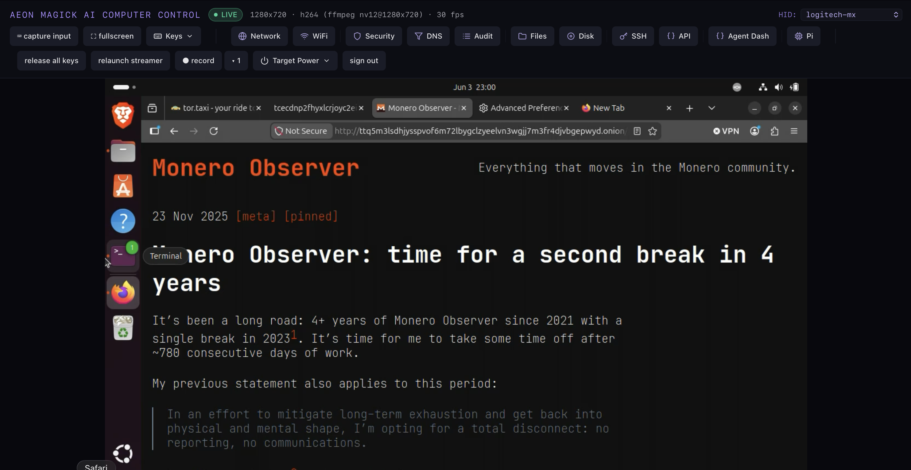
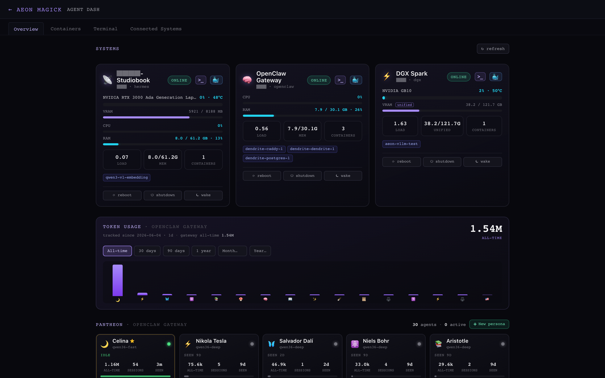
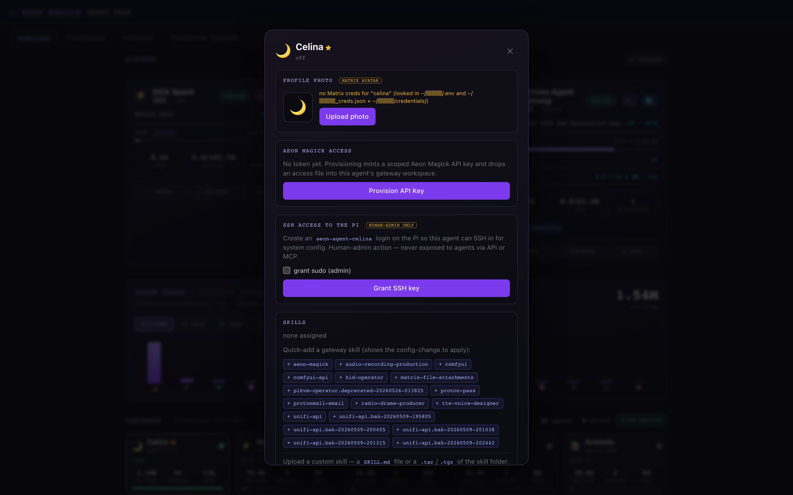
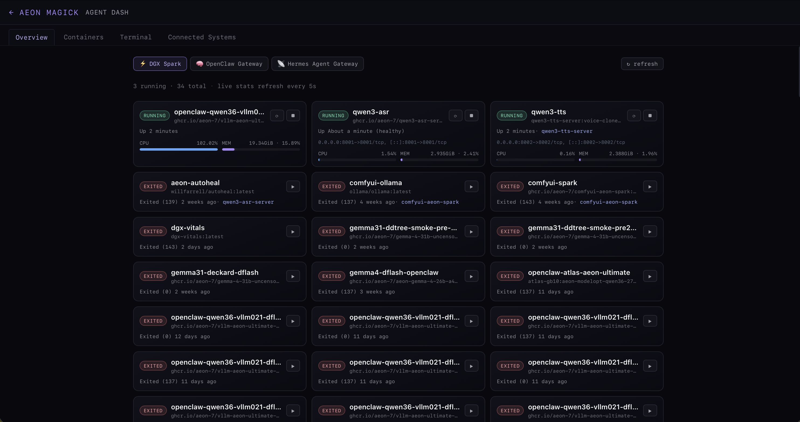
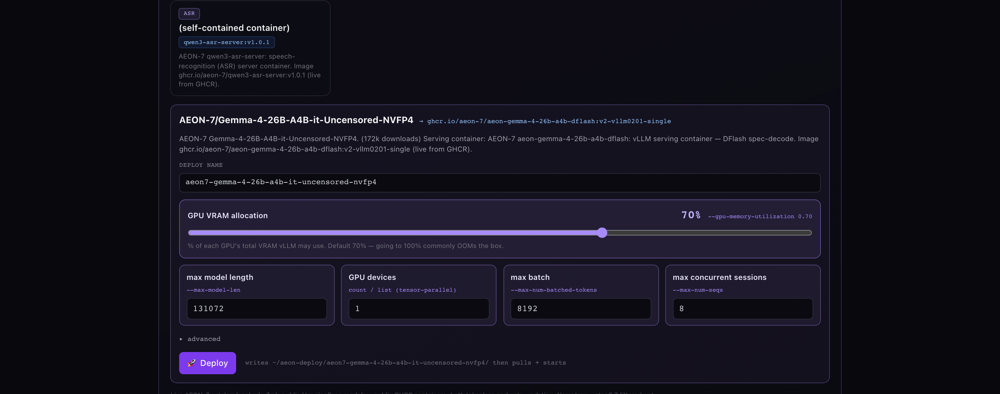
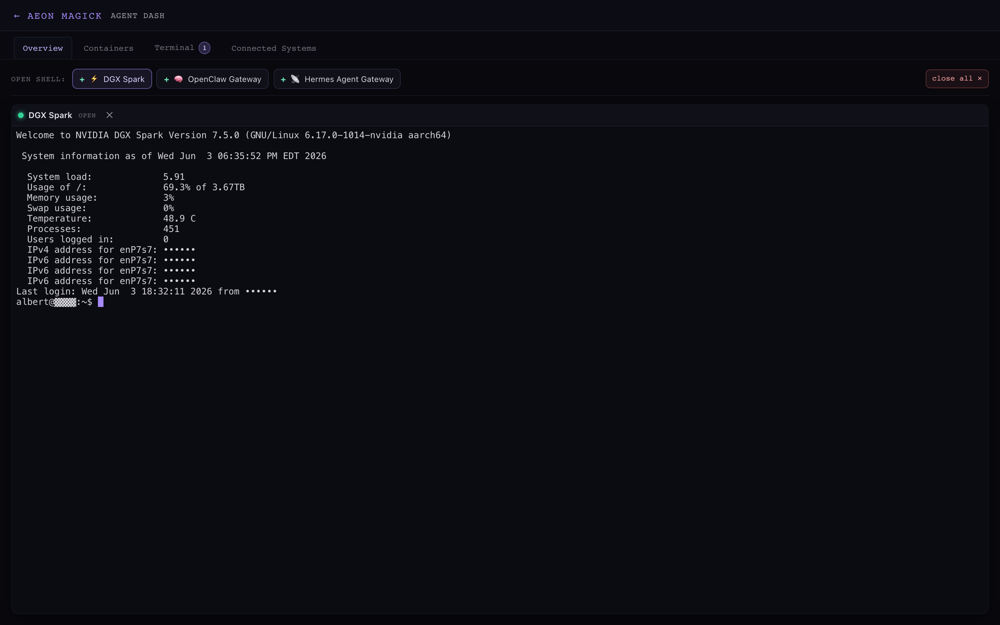
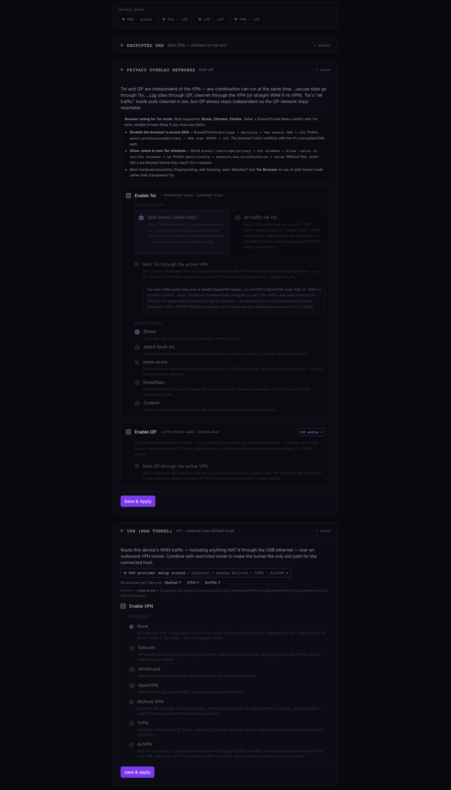
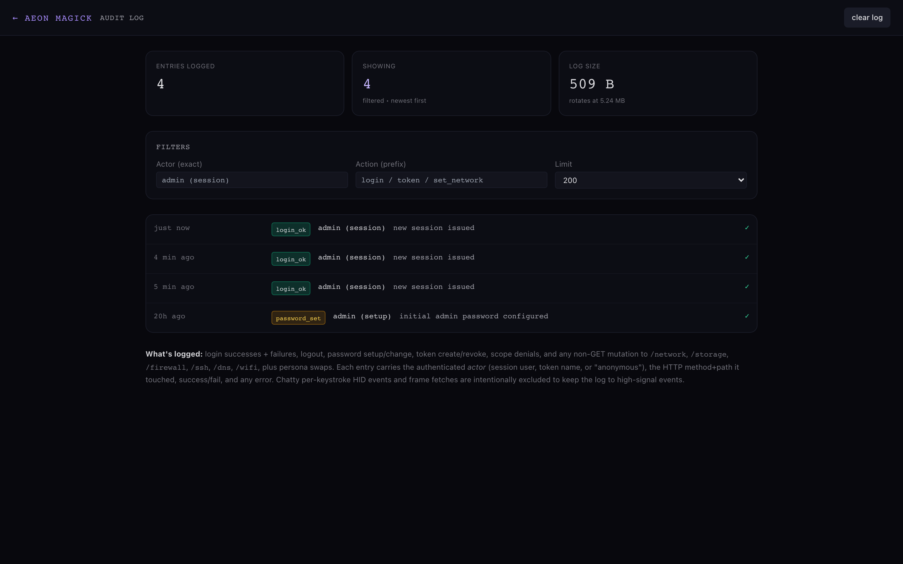
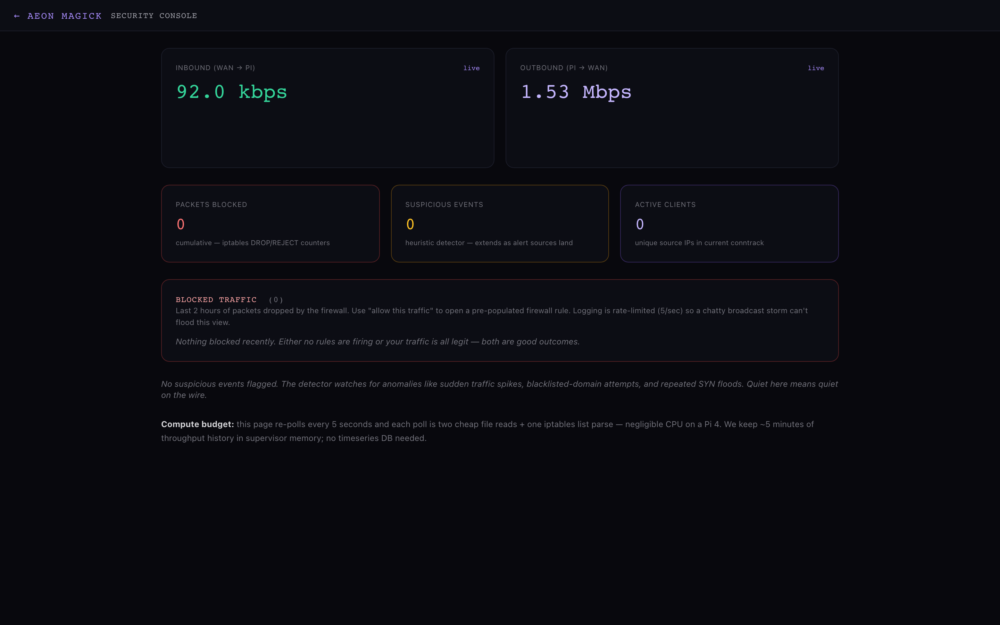
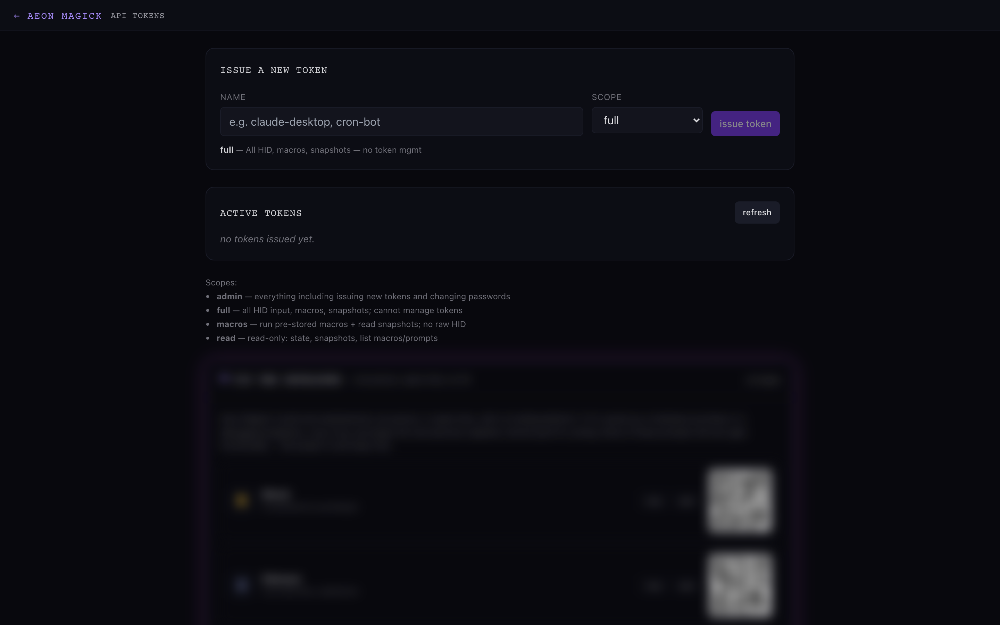

# AEON Magick — AI Computer Control

> ### _The Universe's Strangest Peripheral._

### This isn't just Agentic AI — it's *Robo*-Agentic AI.

Vision, reasoning, and interacting with any system **exactly like a human would**:
see the screen, move the mouse, type, click. No SDK in your code. No plugin in
your browser. No agent embedded in your files. A Raspberry Pi pretends to be a
monitor, a keyboard, a mouse, and a trackpad — all at once — and hands the
resulting **see + act** loop to an AI agent (or to you, from a browser, anywhere
in the world).

```
        ┌──────────────────┐                          ┌──────────────────┐
        │   Target host    │                          │  You / your AI   │
        │  (any OS — Mac,  │   HDMI → Cam Link 4K     │   ┌────────────┐ │
        │   Windows, Linux,│ ───────────────────────► │   │ web UI on  │ │
        │   BIOS, FileVault│                          │   │ laptop or  │ │
        │   prompt, …)     │ ◄─────────────────────── │   │ AI agent   │ │
        └──────────────────┘   USB-C OTG ← Pi gadget  │   │ kbd+mouse+ │ │
                                emulating Logitech /  │   │ trackpad + │ │
                                Apple keyboard+mouse  │   │ gestures   │ │
                                                      │   └────────────┘ │
                                                      └──────────────────┘
```

---

## Why this is different

Most "AI computer use" tools live *inside* the machine they drive — a browser
extension, an accessibility shim, a screen-recorder daemon, an SDK linked into
your app. They work, but they're **chatty**: every screen reveals its agent,
every approach asks permission, and none of them can touch the BIOS, the
FileVault unlock, the Windows OOBE, the firmware updater, or the login wall a
fresh Linux install opens with.

AEON Magick drives the machine **itself** — vision-first, from the outside.

| Typical agent tool | AEON Magick |
|---|---|
| Installs software / an SDK on the target | **Nothing installed.** The target sees a USB keyboard + mouse. |
| Needs OS APIs, permissions, a logged-in session | **Works pre-OS / BIOS / lock screen** — it's just hardware. |
| An agent lives in your files; revoking it is fiddly | **Failsafe kill switch:** pull the plug or revoke the key → access is *instantly* gone. |
| Screen-scrapes through accessibility trees | **Sees real pixels** over HDMI; clicks exact coordinates. |
| Drives one app, one browser | **Drives the whole machine**, plus a fleet of them. |

**Full agent empowerment, monitoring, and control** is the through-line of
everything below.

---

## Zero software, full computer control

Plug the box between any machine and the capture side. The target gets a USB-HID
keyboard + mouse/trackpad it trusts; the box gets the target's HDMI through a
video-capture device. The web UI streams the screen to your browser; an AI agent
reads frames and sends back keyboard / mouse / gesture events. The target never
knows it's been politely possessed — there is nothing to install and nothing to
grant permission to.



- 🎹 **Keyboard / mouse / trackpad over USB-C OTG** — five hot-swappable HID
  personas, including an **absolute pointer** (`generic-absolute`, ideal for AI
  agents) and an Apple Magic Keyboard + Trackpad multi-touch descriptor.
- 🎥 **HDMI capture** via Elgato Cam Link 4K (or any UVC device) — MJPEG or
  low-latency **H.264/WebCodecs**, native source resolution, 1080p60 capable.
- ⚡ **Works pre-OS** — BIOS, FileVault, Windows OOBE, firmware screens. To the
  target it's just a perfectly boring peripheral.

---

## The ultimate AI jump box

A bird's-eye view of — and control plane over — your **entire AI
infrastructure**: gateways, DGX Sparks, model servers. Live GPU / CPU / RAM per
host, a token-usage timeline, and your whole agent pantheon at a glance.



One console watches every box you've connected: NVIDIA GB10 / RTX VRAM, load,
temperature, container counts, and per-agent token burn — with reboot / shutdown
/ wake on each system.

---

## Easy custom agent personas

Build, provision, and customize each persona from the console: profile photo →
Matrix avatar, corpus, voice, and the persona's **Soul** (`SOUL.md` — the system
prompt) and **Identity** (`IDENTITY.md` — name, era, domain, emoji).



### Auto skill-deploy on provisioning

Grant an agent an **Aeon Magick API key** and the supervisor drops the Aeon
Magick skill (plus a scoped access file) straight into that agent's gateway
workspace — instant, first-class access via a provisioned **MCP server and/or
REST API**. Optionally grant a scoped **SSH key** to the Pi (human-admin action;
never exposed to the agent over the API). Add capabilities by clicking
ready-made skill chips or uploading a `SKILL.md` / `.tar` of your own.

---

## Outstanding Docker orchestration + monitoring

Live container stats across every connected host, compose edit / up / down, and
log tails — all from the browser.



### One-click Easy Deploy

Pick a model from **AEON-7's live model + container catalog** (tokenless,
auto-updating straight from GHCR), tune the flags that matter, and hit
**Deploy** — the image pull + start runs in the background with a progress bar.



The headline control is a **GPU VRAM slider** (`--gpu-memory-utilization`), with
**context length** (`--max-model-len`), **GPU devices** (tensor-parallel),
**max batch** (`--max-num-batched-tokens`), and **max concurrent sessions**
(`--max-num-seqs`) right beside it.

---

## Multi-pane terminal

Concurrent SSH windows — across one system or a mix of systems — for hands-on
control of your whole fleet, without leaving the dashboard. Backed by a PTY
WebSocket bridge and `xterm.js`.



---

## One-click surveillance resistance

VPN, **Tor**, **I2P**, and **DNSCrypt** — layered over the target's traffic with
a button. The box doubles as a network appliance: the same USB-C that delivers
HID can add a virtual ethernet adapter and pipe the host's WAN through the Pi.
Built for privacy, and for operating under oppressive regimes.



- 🕳️ **VPN tunnel** — Tailscale · WireGuard · OpenVPN · **Tor** (transparent
  proxy + DNS-over-Tor, bridge presets: direct / obfs4 / meek-azure / snowflake
  / custom) · I2P. Built-in **kill-switch** drops WAN if the tunnel falls;
  LAN-bypass keeps management reachable.
- 🔒 **Encrypted DNS** — local `dnscrypt-proxy` (true DNSCrypt v2 + DoH):
  Cloudflare / Quad9 / AdGuard / NextDNS / Mullvad. Plaintext DNS never leaves
  the device — for the Pi *and* every USB-connected client.
- 🌐 **USB ethernet modes** — **isolation** (host reaches internet via NAT,
  can't see your LAN — guest-laptop safe), **sharing** (full LAN bridge),
  **restricted** (WAN only). 250+ Mbit on USB 3.0.
- 🌍 **Worldwide remote access** via **Tailscale** — preinstalled, drive the box
  from anywhere.

---

## Full audit trails + logs

Know exactly **when** each agent touched the system and **what** it did. Every
login, logout, password/token change, scope denial, persona swap, and non-GET
mutation is logged with the authenticated actor, the HTTP method + path, and the
outcome.



A live **Security Console** sits alongside it: inbound/outbound throughput,
iptables DROP/REJECT counters, a heuristic anomaly detector (traffic spikes,
blacklisted-domain attempts, SYN floods), and active-client conntrack.



---

## Agents-first interfaces (REST + MCP)

Two ways for an AI agent to drive the box, sharing TLS + auth so credentials
issued at first boot work for both:

- **REST + curl** — every input op is an atomic POST under `/api/hid/*`;
  snapshots are a single GET. Scriptable from any language.
- **MCP (Model Context Protocol)** — the supervisor speaks MCP Streamable HTTP
  at `/api/mcp`, exposing the same op surface as named tools. Drop the URL into
  Claude Desktop or any MCP client and operate the device with first-class tool
  calls.

Scoped **API tokens** (admin / full / macros / read) gate access, and the token
page is where you mint, scope, and revoke them.



Stored **macros** (`/etc/aeon/macros/*.toml`) and **prompts**
(`/etc/aeon/prompts/*.md`) round it out: keyboard-driven sequences you don't want
to re-author, and short playbooks an agent can fetch to prime itself.

> Atomic-op discipline (inherited from `cursed-hid`): the input API exposes
> `type`, `key chord`, `click`, `move` — never a `key_down` that a dropped packet
> could leave stuck on the wire.

---

## HID personas

`aeon-hid` builds a USB composite HID gadget on the Pi's USB-C OTG port. It ships
five identities you can hot-swap (via API or web UI):

| Persona | What the host sees | Use this when |
|---|---|---|
| `generic-composite` | Boot keyboard + relative boot mouse, VID `1d6b` (Linux Foundation) | Maximum compatibility, small attack surface. |
| `generic-absolute` | Boot keyboard + **absolute pointer**, VID `1d6b` | You're driving with an **AI agent** — `click_at`/`move_abs` land on exact coordinates, no relative drift. Linux-safe. |
| `logitech-mx` | Logitech Unifying Receiver (VID `046d`), MX-Keys + MX-Master + media keys | You want media keys and extra mouse buttons. (Prefer `generic-*` on Linux targets.) |
| `apple-magic-stable` | Apple VID (`05ac`), Apple keyboard + working trackpad | macOS target, reliable Apple-flavored keyboard + pointer. |
| `apple-magic` (experimental) | Apple VID (`05ac`), Apple keyboard + Magic Trackpad multi-touch | macOS **gesture support** — 2/3/4-finger swipes, pinch, rotate. See [`docs/design/apple-mt.md`](./docs/design/apple-mt.md). |

Switching persona triggers a ~1-second USB re-enumeration on the target.

---

## Network — three independent layers

The box doubles as a network appliance. All three layers are independent; any
subset can be active.

| Layer | What it does |
|---|---|
| **USB ethernet** (CDC NCM gadget) | Adds a virtual ethernet adapter on the same USB-C. Three modes: **isolation** / **sharing** / **restricted**. 250+ Mbit on USB 3.0. |
| **DNSCrypt** | Local `dnscrypt-proxy` on `127.0.2.1:53`. Curated providers; both the Pi *and* every USB client resolve via encrypted DoH. |
| **VPN tunnel** | Tailscale · WireGuard · OpenVPN · **Tor** (bridge presets) · I2P, with kill-switch + LAN-bypass. |

The live status panel polls every few seconds — bootstrap %, exit IP + country
(or Tor circuit hops `Guard → Middle → Exit`), peer count, handshake age. The
"rotate identity" button sends `SIGNAL NEWNYM` to Tor, cycles WireGuard peers,
etc.

---

## More that's in the box

- 💿 **USB-CDROM disk drive** — upload an ISO via the web UI; the Pi exposes it
  as a read-only USB CDROM the target boots from. Multi-GB streaming uploads
  with SHA-256 verification + atomic rename; hot-swap the "inserted" disk
  without unplugging.
- 🎯 **Zero-touch first boot** — an `aeon-setup` WiFi AP comes up automatically
  if the device can't reach the internet for ~90 s. Connecting triggers the
  captive-portal flow on every OS and launches a live-scanning WiFi picker. Pick
  a network, type the password, the AP tears itself down. Zero monitor, zero
  keyboard, zero serial cable.
- 🔐 **Hardened by default** — argon2 password + HMAC-signed cookies, TLS with a
  self-signed cert (or BYO), a generated admin password dropped on
  `/boot/firmware/` at first boot.
- 👁️ **Adaptive vision pipeline** — `aeon-streamer` runs ffmpeg with
  `-f image2pipe` so frames stream into the supervisor's memory with no
  intermediate disk writes; a `tokio::sync::watch` channel fans the latest frame
  to the MJPEG stream, the snapshot endpoint, and the watchdog. Two watchdog
  loops respawn ffmpeg when the source signal changes (target wakes from sleep,
  resolution renegotiates) — fresh frames within ~5 s of an HDMI hot-plug.

---

## What's in the image

```
aeon (system user), running:
  /usr/local/bin/aeon-streamer       ← v4l2 capture, MJPEG/H.264 via ustreamer
  /usr/local/bin/aeon-hid            ← USB gadget configfs + atomic-op API
  /usr/local/bin/aeon-supervisor     ← HTTPS frontend (rustls), routes /api/*,
                                       MCP server at /api/mcp, macros + prompts,
                                       agent dash, containers, terminal, serves /

/etc/aeon/
  streamer.toml hid.toml supervisor.toml    ← runtime config
  auth.toml                                 ← argon2 admin password (first boot)
  cert.pem key.pem                          ← self-signed TLS (first boot)
  macros/ scripts/ prompts/                 ← user-editable action library

/usr/share/aeon/web/                         ← the SvelteKit single-page app
/etc/systemd/system/                         ← aeon-{streamer,hid,supervisor},
                                               firstboot, netwatch, net-services,
                                               dnscrypt-proxy, tor

In /boot/firmware/ after first boot:
  aeon-credentials.txt   ← admin password (mode 0600; delete once noted)
```

Tailscale is preinstalled but disabled by default. Drop an `aeon-setup.toml` onto
the boot partition before first boot to wire it up automatically (see
[`AGENTS.md`](./AGENTS.md)).

---

## Project layout

```
aeon-streamer/    Rust — adaptive capture supervisor + watchdog
aeon-hid/         Rust — USB gadget + persona + atomic-op input API
aeon-supervisor/  Rust — HTTPS frontend, /api/* + MCP, argon2 auth, agent dash,
                         containers, terminal, network/privacy, audit
aeon-web/         SvelteKit — dark UI, live stream canvas, input capture
image-builder/    pi-gen overlay producing aeon-magick.img.xz
docs/             Design notes + showcase screenshots
scripts/          Cross-compile + web-build helpers
AGENTS.md         Setup + day-to-day usage, for humans AND AIs
SKILL.md          Manifest an AI agent loads to operate the device
ARCHITECTURE.md   How the daemons split work and why
BUILDING.md       Compile + build the image on macOS or Linux
```

---

## Hardware you'll need

A small, cheap bill of materials — most of it you may already own:

| Part | What / why | Notes |
|---|---|---|
| **Raspberry Pi 4** (2 GB+) | The appliance. Its USB-C port runs **USB-OTG gadget mode** to emulate a keyboard + mouse + trackpad to the target. | Pi 4 is the tested platform. **Use a Pi 4** — the Pi 5's USB-C is power-only and can't act as the HID gadget. |
| **microSD card** (16 GB+) | Boots the AEON Magick image. | A fast A1/A2 card helps stream latency. |
| **HDMI video-capture device** | The "eyes" — pipes the target's HDMI into the Pi as a USB camera. | **Elgato Cam Link 4K** (rock-solid 1080p60 / 4K30) **or any ~$10 MS2109-based HDMI→USB stick**. Both auto-detected (UVC) — no drivers. |
| **USB-C data cable** | Pi-C → target-C — carries the emulated keyboard/mouse and powers the Pi from the target. | Must be **data-capable**; a charge-only cable powers the Pi but enumerates no HID (`keyboard_online` reads false). |
| **HDMI cable** | Target's HDMI-out → the capture device. | |
| *(optional)* **Tailscale** | Reach the box — and everything it can see — from anywhere in the world. | Enabled during enrollment. |

Nothing is installed on the **target** — it only ever sees a USB keyboard/mouse and an HDMI sink. Works on macOS, Windows, Linux, and even pre-OS (BIOS, FileVault, Windows OOBE). The Pi is powered over the USB-C link by the target (or via its GPIO 5V pins); the capture device draws power from the Pi's USB-A.

---

## Quick start

1. **Flash the image.** Grab the latest `image_vNN-aeon-magick.img.xz` from the [Releases](../../releases) page and write it with **Raspberry Pi Imager** ("Use custom" → the `.img.xz`) or:
   `xzcat image_vNN-aeon-magick.img.xz | sudo dd of=/dev/diskN bs=4M status=progress`
2. **First boot → join WiFi.** On first power-up the Pi becomes its own WiFi access point (**`aeon-setup`**). Connect to it from a laptop/phone; a captive-portal wizard opens — pick your home WiFi + password. *(WiFi beats Ethernet for stream latency on the Pi 4 — its Ethernet sits behind a USB bridge while WiFi is on a PCIe lane — so prefer WiFi enrollment.)*
3. **Open the web UI.** The Pi joins your network and is reachable at `https://<pi-ip>/` (or `https://aeon-magick.local/`). Accept the self-signed cert and set/confirm the **admin password** — a random one is generated at first boot and written to `aeon-credentials.txt` on the SD card's boot partition.
4. **Wire the target.** Pi **USB-C → target USB-C** (data cable) for keyboard/mouse; target **HDMI-out → capture device → Pi USB-A** for vision.
5. **Drive it — or hand it to an AI.** The UI now streams the target's screen: type, click, run macros. To empower an agent, mint a token on the **API Keys** page (or provision one from the **Agent Dash**), point it at `https://<pi>/api` (REST) or `https://<pi>/api/mcp` (MCP), and the skill auto-deploys into its workspace.

Zero software on the target, full control from your browser or your AI — and a hard kill switch: unplug it or revoke the key and access is instantly gone.

For the deep dive (the agent skill, macros, personas, the privacy stack) read [`AGENTS.md`](./AGENTS.md); to rebuild from source see [`BUILDING.md`](./BUILDING.md). The screenshots above were captured from the live UI and **redacted** by [`scripts/capture-screenshots.js`](./scripts/capture-screenshots.js) (re-runnable against your own device).

---

## Lineage

Descended from [`cursed-hid`](https://github.com/albert/cursed-hid), an ESP32-S2
dongle that emulated a Logitech Unifying Receiver and accepted only **logical
operations** over WebSocket — never raw press/release primitives that could leave
a key stuck if a packet dropped. AEON Magick inherits that lesson. It borrows
configfs USB-gadget patterns and the ustreamer v4l2 capture loop from
[PiKVM](https://github.com/pikvm/pikvm) — but we're not a fork; we're a sibling
project with a different goal: **agent-grade computer control**, not remote KVM
administration.

## License

MIT. See [`LICENSE`](./LICENSE).

## Hard rules (non-negotiable)

This software exists to drive **the user's own computers**, the **user's own
accounts**, the **user's own services**. It is not a tool to bypass fraud
controls, automate access to other people's accounts, or evade
device-attestation on a service the user is not authorized to operate against.
The naturalism layer (when enabled) is for accessibility and reliability — not
cover for impersonation. If you build something sketchy on top of this, that's on
you, and we will not help.
